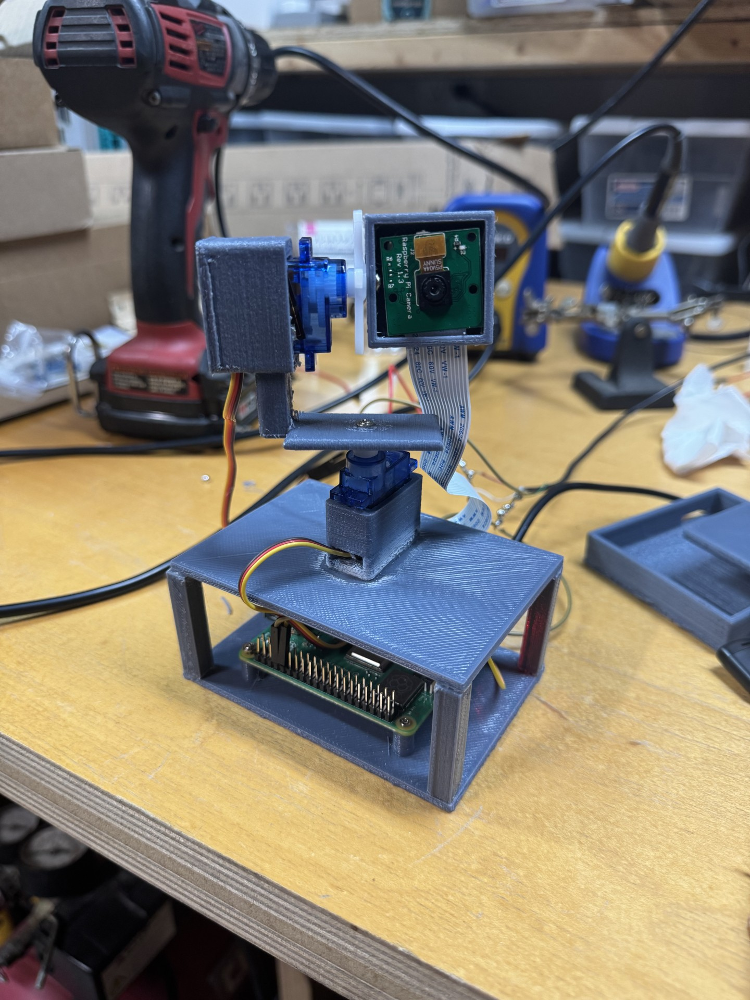

# Sentry Camera

A Raspberry Pi pan-tilt camera that detects a face, moves two servos to follow it, and displays the live video in a browser. The project combines a mechanical mount, basic wiring, Python computer vision, and servo control.

## Demo


## Prototype



The build uses a Raspberry Pi camera, two servos, and a custom 3D-printed pan-tilt mount.

## What it does

- Captures a 320 × 240 camera feed with Picamera2.
- Finds faces with OpenCV's Haar cascade and follows the largest detected face.
- Compares the face position with the center of the frame to control pan and tilt.
- Smooths the detected position, ignores small errors with dead zones, and limits each servo movement.
- Streams the camera feed with face boxes and center lines through Flask.

## Hardware and software

- Raspberry Pi and compatible camera module
- Two servos and a two-axis pan-tilt mount
- Pan servo on GPIO 12; tilt servo on GPIO 13 (BCM numbering)
- Python 3, Picamera2, OpenCV, GPIO Zero with pigpio, and Flask

## Run it

This script runs on a Raspberry Pi with the camera and servos connected. Install the Python libraries for your Raspberry Pi OS version, and ensure the `pigpiod` service is running. The code expects OpenCV's face cascade at `/usr/share/opencv4/haarcascades/haarcascade_frontalface_default.xml`.

```bash
python3 sentry_camera.py
```

Open `http://<raspberry-pi-address>:5000` in a browser on the same local network. The stream has no login, so do not expose port 5000 to the public internet.

## Tracking approach

For each frame, the program detects faces and chooses the largest one. It smooths that face's center position, computes its horizontal and vertical offset from the camera center, and adjusts the servos when the offset exceeds a dead zone. The gain and per-frame movement limits keep the motion gradual; the pan and tilt angles are also bounded for this mount.

## License

MIT. See [LICENSE](LICENSE).

